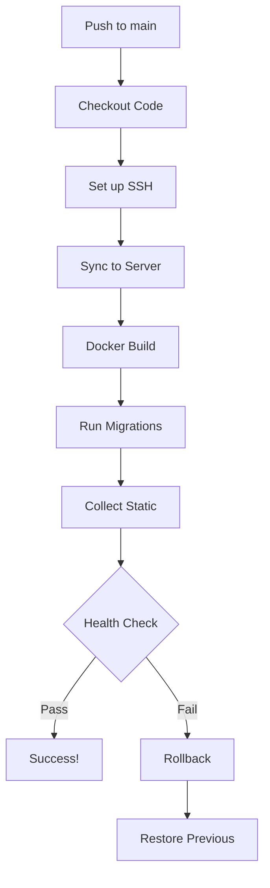

# GitHub Actions CI/CD

This directory contains GitHub Actions workflows for continuous integration and deployment.

## Workflows

### 1. CI Workflow (`ci.yml`)

Runs on every push and pull request to `main` and `develop` branches.

### 2. Deploy Workflow (`deploy.yml`)

Automatically deploys to DigitalOcean production server when code is pushed to `main` branch.

**See [DIGITALOCEAN_SETUP.md](../../DIGITALOCEAN_SETUP.md) for complete setup instructions.**

---

## CI Workflow Details

### CI Workflow (`ci.yml`)

Runs on every push and pull request to `main` and `develop` branches.

#### Jobs

##### 1. Backend Tests (`backend-test`)
- **Environment**: Ubuntu Latest with Python 3.11
- **Steps**:
  - Checkout code
  - Set up Python with pip caching
  - Install Python dependencies
  - Run Django unit and API tests
- **Tests Coverage**:
  - 15 comprehensive tests
  - Model validation tests
  - API endpoint tests (CRUD operations)
  - Game validation rules
  - Player lookup functionality

##### 2. Frontend Tests (`frontend-test`)
- **Environment**: Ubuntu Latest with Node.js 20
- **Steps**:
  - Checkout code
  - Set up Node.js with npm caching
  - Install npm dependencies
  - Run React tests with coverage
  - Build production frontend bundle
- **Tests Coverage**:
  - Component rendering tests
  - Form validation tests
  - User interaction tests
  - API integration tests

##### 3. Docker Build Tests (`docker-build`)
- **Environment**: Ubuntu Latest with Docker Buildx
- **Depends On**: `backend-test`, `frontend-test`
- **Steps**:
  - Checkout code
  - Set up Docker Buildx
  - Build development Docker images
  - Start development containers
  - Test backend API health (port 8000)
  - Test frontend health (port 3000)
  - Tear down development containers
  - Build production Docker images
- **Validates**:
  - Development Docker Compose configuration
  - Production Docker Compose configuration
  - Multi-stage builds
  - Container health checks
  - API accessibility

##### 4. Code Quality (`lint`)
- **Environment**: Ubuntu Latest
- **Steps**:
  - Checkout code
  - Lint Python code with flake8
  - Lint JavaScript code via build process
- **Quality Checks**:
  - Python syntax errors
  - Undefined names
  - Code complexity
  - Line length
  - React build warnings

## Status Badge

Add this badge to your README to show CI status:

```markdown

```

Replace `YOUR_USERNAME` with your GitHub username.

## Running Tests Locally

### Backend Tests
```bash
cd backend
python -m venv venv
source venv/bin/activate
pip install -r requirements.txt
python manage.py test
```

### Frontend Tests
```bash
cd frontend
npm install
npm test -- --watchAll=false --coverage
```

### Docker Tests
```bash
# Development build
docker compose build
docker compose up -d
curl http://localhost:8000/api/players/
curl http://localhost:3000/
docker compose down

# Production build
docker compose -f docker-compose.prod.yml build
```

## Environment Variables for CI

The following environment variables are used in CI builds:

- `DJANGO_SECRET_KEY`: Test secret key (production requires real secret)
- `DJANGO_ALLOWED_HOSTS`: Comma-separated list of allowed hosts
- `REACT_APP_API_URL`: API endpoint URL for frontend
- `DATABASE_URL`: SQLite database path

## Caching Strategy

To speed up CI builds, the following caches are used:

1. **Python dependencies**: `pip` cache based on `requirements.txt`
2. **Node.js dependencies**: `npm` cache based on `package-lock.json`
3. **Docker layers**: Docker Buildx cache for faster image builds

## Troubleshooting CI Failures

### Backend Test Failures
- Check Python version compatibility (3.11)
- Verify all dependencies are in `requirements.txt`
- Ensure database migrations are applied
- Check for Django settings issues

### Frontend Test Failures
- Check Node.js version compatibility (20)
- Verify all dependencies are in `package.json`
- Ensure tests don't require browser-specific features
- Check for missing test mocks

### Docker Build Failures
- Verify Dockerfile syntax
- Check for missing dependencies in container
- Ensure proper file permissions
- Validate environment variable requirements
- Check port conflicts

### Lint Failures
- Run `flake8` locally to see specific issues
- Fix Python syntax errors and undefined names
- Address code complexity warnings
- Check for React build warnings

## Adding New Tests

### Backend Tests
Add new tests to `backend/tournament/tests.py` or create new test files:
```python
from django.test import TestCase

class MyNewTest(TestCase):
    def test_something(self):
        # Your test code
        pass
```

### Frontend Tests
Add new tests alongside your components:
```javascript
import { render, screen } from '@testing-library/react';
import MyComponent from './MyComponent';

test('renders component', () => {
  render(<MyComponent />);
  expect(screen.getByText(/hello/i)).toBeInTheDocument();
});
```

## Future Enhancements

Potential CI/CD improvements:

1. **Code Coverage Requirements**: Fail build if coverage drops below threshold
2. **Performance Testing**: Add load testing with tools like Locust
3. **Security Scanning**: Add dependency vulnerability scanning
4. **E2E Testing**: Add Playwright or Cypress for end-to-end tests
5. **Docker Image Publishing**: Push images to Docker Hub or GitHub Container Registry
6. **Slack/Email Notifications**: Notify team on build failures
7. **Scheduled Tests**: Run tests nightly even without code changes
8. **Staging Environment**: Add staging deployment before production

---

## Deploy Workflow Details

### Deploy Workflow (`deploy.yml`)

Deploys application to DigitalOcean production server.

#### Triggers

- **Automatic**: On push to `main` branch
- **Manual**: Via GitHub Actions UI (workflow_dispatch)

#### Jobs

##### Deploy to Production (`deploy`)

**Environment**: 
- Ubuntu Latest with SSH and rsync
- Uses `production` environment with protection rules

**Steps**:

1. **Checkout code**: Get latest code from repository
2. **Set up SSH**: Configure SSH agent with private key from secrets
3. **Add known hosts**: Register server's SSH fingerprint
4. **Create .env file**: Generate environment configuration from GitHub secrets
5. **Deploy to server**: 
   - Create deployment directory on server
   - Sync code via rsync (excludes .git, node_modules, etc.)
   - Copy .env file securely
6. **Build and start services**:
   - Run `docker compose -f docker-compose.prod.yml up -d --build`
   - Apply database migrations
   - Collect static files
   - Show service status
7. **Health check**: Verify application responds at API endpoint
8. **Cleanup**: Remove temporary .env file
9. **Notifications**: Display success message with deployment URL
10. **Rollback**: Automatically revert to previous version on failure

#### Required GitHub Secrets

| Secret | Description |
|--------|-------------|
| `SSH_PRIVATE_KEY` | SSH private key for server access |
| `SERVER_IP` | DigitalOcean droplet IP address |
| `SERVER_USER` | SSH username (root or ubuntu) |
| `DEPLOY_PATH` | Deployment directory path on server |
| `DJANGO_SECRET_KEY` | Django secret key (generate with `openssl rand -base64 32`) |
| `DJANGO_ALLOWED_HOSTS` | Comma-separated list of allowed hosts |
| `REACT_APP_API_URL` | Frontend API endpoint URL |
| `DATABASE_URL` | Database connection string |
| `PRODUCTION_URL` | Application URL for health checks |

#### Deployment Process



#### Security Features

- ✓ SSH key authentication (no passwords)
- ✓ Secrets never exposed in logs
- ✓ Temporary .env file cleanup
- ✓ Server host verification
- ✓ Automatic rollback on failure

#### Setup Instructions

Complete setup guide available in [DIGITALOCEAN_SETUP.md](../../DIGITALOCEAN_SETUP.md)

**Quick Setup:**

1. Create DigitalOcean droplet with Docker
2. Add GitHub secrets (9 required secrets)
3. Push to `main` branch
4. Monitor deployment in GitHub Actions

#### Monitoring Deployments

**GitHub UI:**
- Go to **Actions** tab
- Click on **Deploy to DigitalOcean** workflow
- View real-time logs for each deployment

**Server Logs:**
```bash
ssh root@YOUR_SERVER_IP
cd ~/baum-vibe
docker compose -f docker-compose.prod.yml logs -f
```

#### Manual Deployment

If automated deployment fails, deploy manually:

```bash
# SSH into server
ssh root@YOUR_SERVER_IP

# Navigate to deployment directory
cd ~/baum-vibe

# Pull latest code
git pull origin main

# Rebuild and restart
docker compose -f docker-compose.prod.yml up -d --build

# Run migrations
docker compose -f docker-compose.prod.yml exec backend python manage.py migrate

# Collect static files
docker compose -f docker-compose.prod.yml exec backend python manage.py collectstatic --noinput
```

#### Troubleshooting Deployments

**SSH Connection Failed:**
- Verify `SSH_PRIVATE_KEY` secret is correct
- Check server firewall allows SSH (port 22)
- Ensure SSH key is added to server's `~/.ssh/authorized_keys`

**Docker Build Failed:**
- Check server has enough disk space (`df -h`)
- Verify Docker is installed (`docker --version`)
- Check Docker service is running (`sudo systemctl status docker`)

**Health Check Failed:**
- Check service logs: `docker compose logs backend`
- Verify firewall allows HTTP/HTTPS (ports 80/443)
- Ensure `PRODUCTION_URL` secret matches server URL
- Check nginx configuration

**Database Migration Failed:**
- Run migrations manually: `docker compose exec backend python manage.py migrate`
- Check database file permissions
- Verify volume mount is correct

---

## Future Enhancements

Potential CI/CD improvements:

1. **Code Coverage Requirements**: Fail build if coverage drops below threshold
2. **Performance Testing**: Add load testing with tools like Locust
3. **Security Scanning**: Add dependency vulnerability scanning
4. **E2E Testing**: Add Playwright or Cypress for end-to-end tests
5. **Docker Image Publishing**: Push images to Docker Hub or GitHub Container Registry
6. **Slack/Email Notifications**: Notify team on build failures
7. **Scheduled Tests**: Run tests nightly even without code changes
8. **Staging Environment**: Add staging deployment before production
9. **Blue-Green Deployments**: Zero-downtime deployments
10. **Database Backups**: Automated backup before deployment

## Contributing

When contributing, ensure:
1. All tests pass locally before pushing
2. New features include appropriate tests
3. Code follows project style guidelines
4. Docker builds succeed locally
5. Documentation is updated as needed
